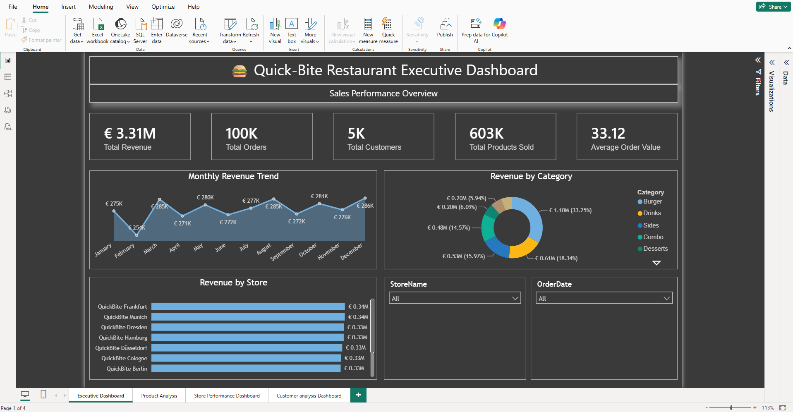
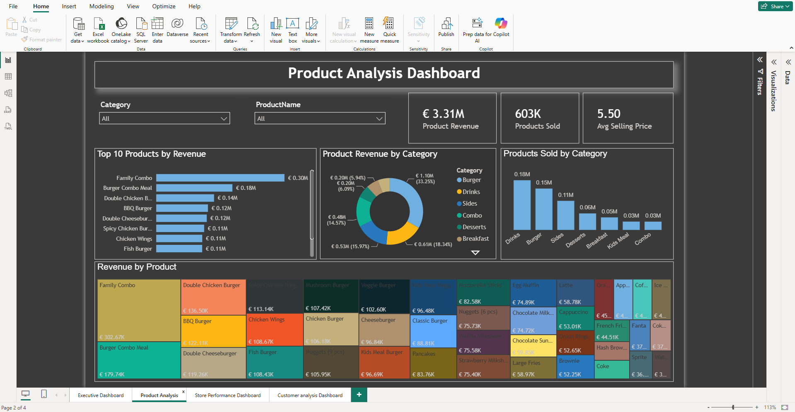
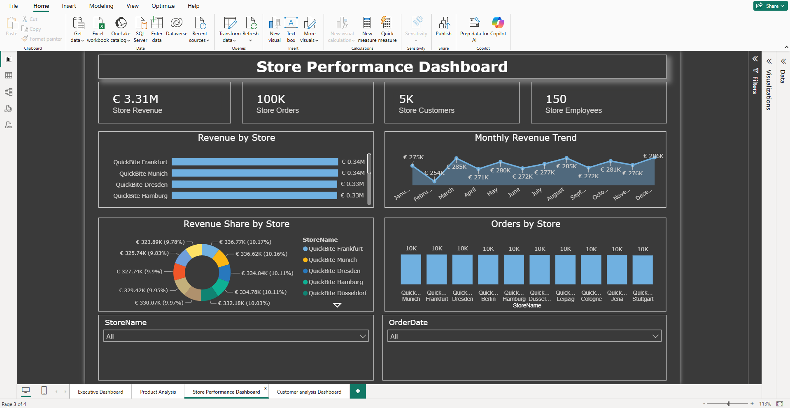
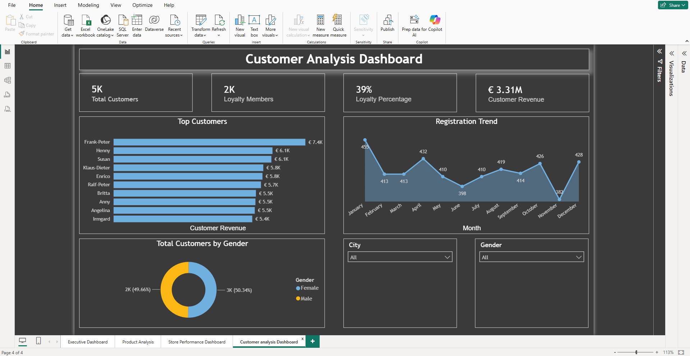

# 🍔 QuickBite Restaurant Analytics Dashboard


## Problem Statement


This project demonstrates an end-to-end Business Intelligence solution for a restaurant chain using **SQL Server**, **Power BI**, and **DAX**.

The objective of this project is to analyze restaurant operations by providing insights into sales, products, stores, and customers through interactive dashboards.

The solution helps business users answer questions such as:

- Which products generate the highest revenue?
- Which store performs the best?
- Who are the most valuable customers?
- How do sales change over time?
- Which product categories contribute the most to revenue?

## 🛠 Tools & Technologies Used

- Python
- Pandas
- SQL Server
- SQL Server Management Studio (SSMS)
- Power BI Desktop
- DAX
- Git
- GitHub
- Visual Studio Code

# Database Design

A relational SQL Server database was designed consisting of six tables.

- Customers
- Orders
- OrderItems
- Products
- Stores
- Employees

Primary Keys and Foreign Keys were implemented to build relationships between the tables before importing the data into Power BI.

# Project Workflow

### Step 1

Designed and created a custom restaurant dataset using **Python (Pandas)** to simulate real-world business operations.

The dataset includes realistic information for:

- Customers
- Stores
- Employees
- Products
- Orders
- Order Items
## 🐍 Python Dataset Generation

The Python scripts used to generate the QuickBite dataset are available in the **Python** folder.

- [generate_Customers.py](04_Python/generate_Customers.py)
- [products.py](Python/products.py)
- [stores.py](Python/stores.py)
- [employees.py](Python/employees.py)
- [orders.py](Python/orders.py)
- [orderitems.py](Python/orderitems.py)

Python was used to:

- Generate synthetic business data
- Define relationships between entities
- Create realistic records for restaurant operations
- Export the datasets as CSV files for SQL Server import

### Step 2

Created a SQL Server database named **QuickBite**.

---

### Step 3

Imported CSV datasets into SQL Server.

The following tables were created:

- Customers
- Employees
- Stores
- Products
- Orders
- OrderItems

---

### Step 4

Defined appropriate data types for each column.

Examples:

- nvarchar
- int
- float
- datetime2
- date
- tinyint

---

### Step 5

Verified data quality.

- Checked row counts
- Validated primary keys
- Removed datatype issues
- Corrected Quantity datatype

---

### Step 6

Created SQL queries for business analysis.

Some examples include:

- Total Revenue
- Total Orders
- Total Customers
- Revenue by Store
- Revenue by Product
- Top Selling Products
- Monthly Revenue Trend
- Category Performance
- Customer Analysis

---

### Step 7

Imported SQL Server tables into Power BI Desktop.

---

### Step 8

Created relationships between the tables.

Relationships include:

- Customers → Orders
- Stores → Orders
- Employees → Orders
- Products → OrderItems
- Orders → OrderItems

A star schema model was used for reporting.

---

### Step 9

Created DAX Measures.

Examples include:

```DAX
Total Revenue =
SUM(Orders[TotalAmount])
```

```DAX
Total Orders =
COUNT(Orders[OrderID])
```

```DAX
Total Customers =
DISTINCTCOUNT(Orders[CustomerID])
```

```DAX
Products Sold =
SUM(OrderItems[Quantity])
```

```DAX
Average Order Value =
DIVIDE([Total Revenue],[Total Orders])
```

Additional measures were created for:

- Product Revenue
- Average Selling Price
- Loyalty Percentage
- Store Revenue
- Customer Revenue

---

### Step 10

Built four interactive dashboards.

Snap of Executive Dashboard,

# Executive Dashboard



Snap of Product Analysis Dashboard,

# Product Analysis Dashboard



Snap of Store Performance Dashboard,

# Store Performance Dashboard



Snap of Customer Analysis Dashboard,

# Customer Analysis Dashboard




# Dashboard Pages

## 1️⃣ Executive Dashboard

KPIs

- Total Revenue
- Total Orders
- Total Customers
- Total Products Sold
- Average Order Value

Visualizations

- Monthly Revenue Trend
- Revenue by Store
- Revenue by Category

Slicers

- Store
- Order Date

---

## 2️⃣ Product Analysis Dashboard

KPIs

- Product Revenue
- Products Sold
- Average Selling Price

Visualizations

- Top 10 Products by Revenue
- Revenue by Category
- Products Sold by Category
- Product Revenue Treemap

Slicers

- Category
- Product Name

---

## 3️⃣ Store Performance Dashboard

KPIs

- Store Revenue
- Total Orders
- Total Customers
- Total Stores

Visualizations

- Revenue by Store
- Orders by Store
- Monthly Revenue Trend
- Revenue Share by Store

Slicers

- Store
- Order Date

---

## 4️⃣ Customer Analysis Dashboard

KPIs

- Total Customers
- Loyalty Members
- Loyalty Percentage
- Customer Revenue

Visualizations

- Top Customers
- Customers by City
- Gender Distribution
- Customer Registration Trend
- Revenue by Loyalty Status

Slicers

- City
- Gender


# Skills Demonstrated

## SQL

- Database Design
- Primary & Foreign Keys
- Joins
- Aggregations
- GROUP BY
- ORDER BY
- CASE Statements
- Business Queries

---

## Power BI

- Data Modeling
- Relationships
- Interactive Dashboards
- Drill-down Analysis
- Slicers
- Cross Filtering
- Themes
- Report Navigation

---

## DAX

- SUM
- COUNT
- DISTINCTCOUNT
- SUMX
- DIVIDE
- AVERAGE
- CALCULATE
- RELATED

---

# Business Insights

The dashboards enable restaurant management to:

- Monitor overall sales performance.
- Identify high-performing products.
- Compare store performance.
- Track customer loyalty.
- Analyze purchasing trends.
- Understand category-wise revenue contribution.
- Identify top revenue-generating customers.


# Conclusion

This project demonstrates an end-to-end Business Intelligence solution, beginning with data cleaning and preparation in **Python (Pandas)**, followed by database design and querying in **SQL Server**, and concluding with interactive dashboard development in **Power BI** using **DAX**.

The project highlights practical experience in **Python, Pandas, SQL, ETL, data modeling, DAX, data visualization, and business intelligence**, showcasing the complete analytics workflow expected of a Data Analyst.

