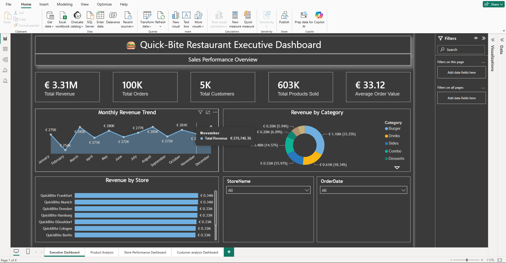

# 🍔 QuickBite Restaurant Analytics Dashboard

## Problem Statement

This project demonstrates an end-to-end Business Intelligence solution for a restaurant chain using **Python, SQL Server, Power BI, and DAX**.

The objective of this project is to analyze restaurant operations by transforming raw business data into meaningful insights through interactive dashboards.

The dashboard enables restaurant management to monitor sales performance, compare store performance, analyze customer behavior, evaluate product sales, and identify business trends for better decision-making.

---

# 🛠 Tools & Technologies Used

- Python
- Pandas
- Faker
- SQL Server
- SQL Server Management Studio (SSMS)
- Power BI Desktop
- DAX
- Git
- GitHub
- Visual Studio Code

---

# Database Design

A relational SQL Server database was designed consisting of six tables.

- Customers
- Orders
- OrderItems
- Products
- Stores
- Employees

Primary Keys and Foreign Keys were implemented to establish relationships between the tables before importing them into Power BI.

---

# Project Workflow

### Step 1

Designed and generated a custom restaurant dataset using **Python (Pandas)** to simulate real-world restaurant operations.

The dataset includes:

- Customers
- Products
- Stores
- Employees
- Orders
- Order Items

Python was used to:

- Generate synthetic business data
- Create realistic customer and sales records
- Simulate restaurant transactions
- Export datasets for SQL Server

## 🐍 Python Dataset Generation

The Python source code is available in the **04_Python** folder.

- [generate_Customers.py](04_Python/generate_Customers.py)
- [generate_employees.py](04_Python/generate_employees.py)
- [generate_orders.py](04_Python/generate_orders.py)
- [generate_orderitems.py](04_Python/generate_orderitems.py)
- [Update_order_totals.py](04_Python/Update_order_totals.py)

---

### Step 2

Created a SQL Server database named **QuickBite**.

---

### Step 3

Imported the generated datasets into SQL Server.

The following tables were created:

- Customers
- Employees
- Stores
- Products
- Orders
- OrderItems

---

### Step 4

Defined appropriate data types for each table.

Examples include:

- NVARCHAR
- INT
- FLOAT
- DATE
- DATETIME2
- TINYINT

---

### Step 5

Performed data validation.

- Verified row counts
- Checked Primary Keys
- Validated Foreign Keys
- Corrected data types
- Removed inconsistencies

---

### Step 6

Created SQL queries to answer business questions.

Examples include:

- Total Revenue
- Total Orders
- Total Customers
- Revenue by Store
- Revenue by Product
- Revenue by Category
- Monthly Revenue Trend
- Top Customers
- Product Performance

---

### Step 7

Imported SQL Server tables into Power BI Desktop.

---

### Step 8

Created relationships between the tables.

Relationships include:

- Customers → Orders
- Stores → Orders
- Employees → Orders
- Orders → OrderItems
- Products → OrderItems

A star schema model was implemented for reporting.

---

### Step 9

Created DAX measures for dashboard analysis.

<details>
<summary>📊 View DAX Measures</summary>

```DAX
Total Revenue =
SUM(Orders[TotalAmount])
```

```DAX
Total Orders =
COUNT(Orders[OrderID])
```

```DAX
Total Customers =
DISTINCTCOUNT(Orders[CustomerID])
```

```DAX
Products Sold =
SUM(OrderItems[Quantity])
```

```DAX
Average Order Value =
DIVIDE([Total Revenue],[Total Orders])
```

</details>

Additional measures include:

- Product Revenue
- Average Selling Price
- Loyalty Members
- Loyalty Percentage
- Customer Revenue
- Store Revenue

---

### Step 10

Built four interactive dashboards in Power BI.

# Dashboard Snapshots

## Executive Dashboard



---

## Product Analysis Dashboard


---

## Store Performance Dashboard


---

## Customer Analysis Dashboard


---

# Dashboard Pages

## Executive Dashboard

KPIs

- Total Revenue
- Total Orders
- Total Customers
- Total Products Sold
- Average Order Value

Visualizations

- Monthly Revenue Trend
- Revenue by Store
- Revenue by Category

---

## Product Analysis Dashboard

KPIs

- Product Revenue
- Products Sold
- Average Selling Price

Visualizations

- Top Products by Revenue
- Revenue by Category
- Product Revenue Treemap
- Products Sold by Category

---

## Store Performance Dashboard

KPIs

- Store Revenue
- Total Orders
- Total Customers
- Total Stores

Visualizations

- Revenue by Store
- Orders by Store
- Monthly Revenue Trend
- Revenue Share by Store

---

## Customer Analysis Dashboard

KPIs

- Total Customers
- Loyalty Members
- Loyalty Percentage
- Customer Revenue

Visualizations

- Top Customers
- Customer Distribution
- Revenue by Loyalty Status
- Registration Trend

---

# Business Insights

The QuickBite Restaurant Analytics Dashboard provides valuable insights into restaurant operations, enabling management to make data-driven decisions.

Following insights can be drawn from the dashboard:

---

## [1] Executive Dashboard

### Sales Performance

- **Total Revenue:** **€3.31 Million**
- **Total Orders:** **100K**
- **Total Customers:** **5K**
- **Total Products Sold:** **603K**
- **Average Order Value:** **€33.12**

### Revenue Trend

- Monthly revenue ranges from **€254K** to **€286K**.
- **December** recorded the highest monthly revenue (**€286K**).
- **February** recorded the lowest monthly revenue (**€254K**).
- Revenue remained relatively stable throughout the year with only minor fluctuations.

### Revenue by Category

Category-wise contribution to total revenue:

| Category | Revenue | Share |
|----------|---------:|------:|
| Burger | €1.10M | 33.25% |
| Drinks | €0.61M | 18.34% |
| Sides | €0.53M | 15.97% |
| Combo | €0.48M | 14.57% |
| Desserts | €0.20M | 6.09% |
| Breakfast | €0.20M | 5.94% |

**Insight**

Burgers generated the highest revenue, contributing approximately one-third of total restaurant sales.

---

## [2] Product Analysis Dashboard

### Overall Product Performance

- **Product Revenue:** **€3.31 Million**
- **Products Sold:** **603K**
- **Average Selling Price:** **€5.50**

### Top Revenue Generating Products

| Product | Revenue |
|---------|---------:|
| Family Combo | €302.67K |
| Burger Combo Meal | €179.74K |
| Double Chicken Burger | €136.50K |
| BBQ Burger | €122.11K |
| Double Cheeseburger | €119.26K |
| Spicy Chicken Burger | €113.14K |
| Chicken Wings | €108.67K |
| Fish Burger | €108.43K |

### Products Sold by Category

- Drinks – **180K**
- Burgers – **150K**
- Sides – **110K**
- Desserts – **60K**
- Breakfast – **50K**
- Kids Meal – **30K**
- Combo – **30K**

**Insight**

Family Combo is the highest revenue-generating product, while Drinks represent the highest-selling product category.

---

## [3] Store Performance Dashboard

### Overall Store Performance

- **Store Revenue:** **€3.31 Million**
- **Store Orders:** **100K**
- **Store Customers:** **5K**
- **Store Employees:** **150**

### Top Performing Stores

| Store | Revenue |
|--------|---------:|
| QuickBite Frankfurt | €0.34M |
| QuickBite Munich | €0.34M |
| QuickBite Dresden | €0.33M |
| QuickBite Hamburg | €0.33M |
| QuickBite Düsseldorf | €0.33M |

### Orders by Store

Each restaurant processed approximately **10K orders**, demonstrating a balanced workload across locations.

### Revenue Distribution

Revenue is evenly distributed among all stores, with each location contributing roughly **10%** of total revenue.

**Insight**

Store performance is highly consistent across all locations, indicating balanced business operations and customer demand.

---

## [4] Customer Analysis Dashboard

### Customer Overview

- **Total Customers:** **5K**
- **Loyalty Members:** **2K**
- **Loyalty Percentage:** **39%**
- **Customer Revenue:** **€3.31 Million**

### Top Customers

| Customer | Revenue |
|----------|---------:|
| Frank-Peter | €7.4K |
| Henny | €6.1K |
| Susan | €6.1K |
| Klaus-Dieter | €5.8K |
| Enrico | €5.8K |

### Gender Distribution

- Female Customers: **50.34%**
- Male Customers: **49.66%**

The customer base is almost equally distributed between male and female customers.

### Customer Registration Trend

Monthly customer registrations vary between **382** and **455** new customers, showing a steady customer acquisition trend throughout the year.

**Insight**

Approximately **39%** of customers are enrolled in the loyalty program, providing opportunities to improve customer retention through targeted marketing and loyalty campaigns.

---

# Overall Business Findings

- The restaurant generated **€3.31 Million** in total revenue from **100K** orders.
- Burgers are the highest revenue-generating product category.
- Family Combo is the best-performing product based on revenue.
- Drinks represent the highest-selling product category by quantity sold.
- Revenue is evenly distributed across all restaurant locations.
- All stores processed approximately **10K** orders, indicating balanced operational performance.
- Customer distribution is nearly equal between male and female customers.
- Nearly **40%** of customers participate in the loyalty program.
- Monthly revenue remained stable throughout the year, with December being the highest-performing month.
- Interactive Power BI dashboards enable dynamic filtering by Store, Product Category, Customer, Gender, City, and Order Date for detailed business analysis.
---

# Skills Demonstrated

## Python

- Pandas
- Faker
- Synthetic Data Generation
- Data Validation
- Data Export

---

## SQL

- Database Design
- Primary Keys
- Foreign Keys
- Joins
- GROUP BY
- ORDER BY
- Aggregate Functions
- Business Queries

---

## Power BI

- Data Modeling
- Interactive Dashboards
- Relationships
- Slicers
- Drill-down Analysis
- Report Navigation

---

## DAX

- SUM
- COUNT
- DISTINCTCOUNT
- SUMX
- DIVIDE
- CALCULATE
- RELATED
- AVERAGE

---

# Key Business Findings

- Identified the highest revenue-generating product category.
- Compared revenue across all restaurant locations.
- Identified top customers based on spending.
- Evaluated customer loyalty participation.
- Analyzed monthly sales trends.
- Compared store performance using interactive dashboards.
- Enabled dynamic filtering using slicers and cross-filtering.

---

# Conclusion

This project demonstrates a complete Business Intelligence workflow, beginning with **custom dataset generation using Python (Pandas)**, followed by **SQL Server database design and querying**, and culminating in **interactive Power BI dashboards using DAX**.

The project showcases practical experience in **Python, Pandas, SQL, ETL, data modeling, DAX, data visualization, dashboard design, and business intelligence**, making it a strong portfolio project for Data Analyst roles.
